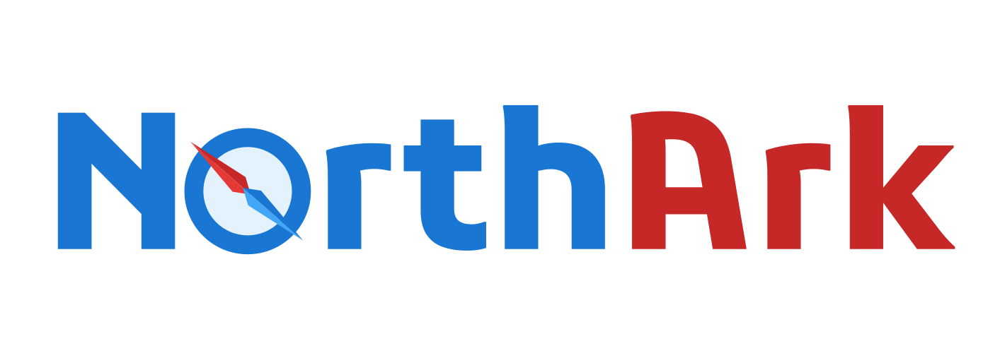

# NorthArk Banks

Initial project for the capstone project: NorthArk Banks.

**Remember not to push API keys to git!**

## Design 
Palette and Logo designs can be found inside of the Figma file.
[Figma ProtoTyping WIP](https://www.figma.com/file/UMI1G9rYU3Sd6FDTomnjsB/NorthArk-Banks?node-id=0%3A1)

## R&D

#### Project overview
-	Statement of business needs (What is the apps purpose at a glance)?
-	Basic functionality requirements
-	Schedule constraints (6 weeks) Sprints are 1 week

##### **Statement of business**:
ArkNorth is a banking app that allows the user to login, view their banking information and transactions, and generate reports.

**Functionality**:
-	User Login on a backend server for functionality. - No user data should be stored on the client side for security purposes.
-	Ability for a user to view their balance and transaction history.
-	Generate a 12-month report of user’s bank statements.

**High Importance**:
-	Password recovery.
-	More report types and sorting.

**Nice to haves**:
-	Dark mode for accessibility
-	Data charts for reporting

#### Tech stack related
- Front end language - JavaScript
  - React Library
    - State management solution Redux/context?
- Back end language - C# and ASP.net
- Database solution
  - SQL - T-SQL - noSQL?
